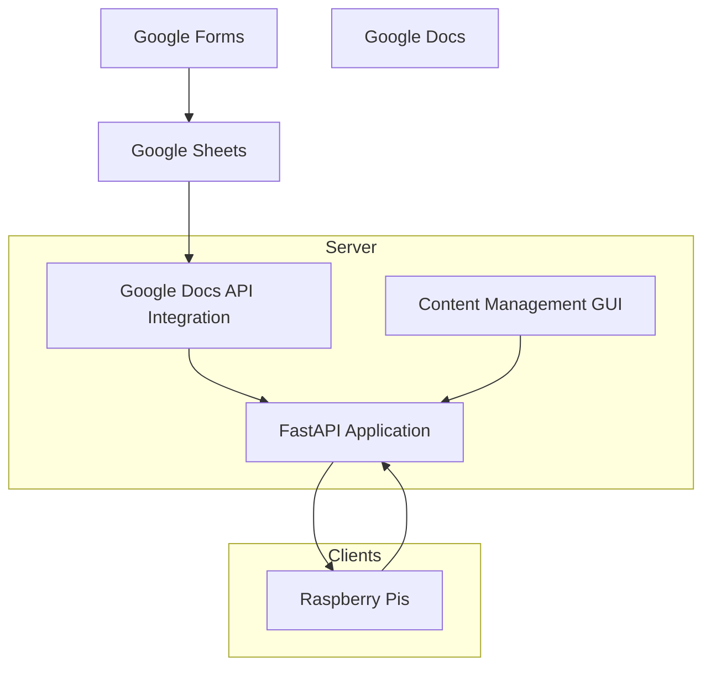
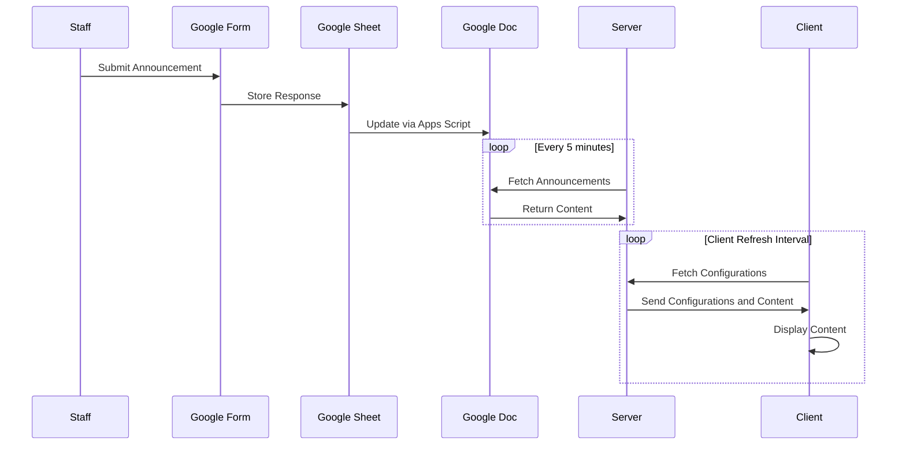

# Pi Monitor System Overview

## Introduction

The **Pi Monitor System** is designed to display school-related information on
monitors throughout the school using Raspberry Pis. The system consists of a
server that manages content and configurations, clients running on Raspberry Pis
that display the content, and a content management interface for easy updates.
This document provides an overview of the system's architecture, components, and
data flow.

## System Architecture

The system is composed of several key components that work together to deliver
content to the monitors:

- **Server:** A FastAPI application that serves content and configurations.

- **Clients:** Raspberry Pis that fetch and display content on monitors.

- **Content Management GUI:** A web interface for updating monitor
configurations.

- **Announcements Integration:** Automated fetching and display of announcements
from Google Docs.

Below is a high-level architecture diagram of the system:

## Components

### Server

The server is a FastAPI application (`monitor.py`) that handles:

- **Serving Content:** Provides configurations and content to the clients.

- **Content Management GUI:** Accessible via the `/update` endpoint, allowing
authorized users to update configurations through a web interface.

- **Announcements Fetching:** Retrieves announcements from a Google Docs
document, which is updated via a Google Apps Script.

**Key Files:**

- `monitor.py`: Main server application.
- `monitor_update.html`: Content management GUI.
- `config/monitor.json`: Stores current monitor configurations.
- `config/monitor_password.txt`: Stores the bcrypt-hashed admin password for
authentication.

### Clients

Clients are Raspberry Pis connected to monitors, running scripts that:

- **Fetch Content:** Retrieve configurations and content from the server.
- **Display Content:** Use `monitor.html` and associated JavaScript files to
display content.
- **Auto-Update:** Pull updates from the GitHub repository to stay up-to-date.

**Key Files:**

- `pi/client`: Starts the Chromium browser in kiosk mode to display content.
- `pi/client_manager`: Manages client script execution and updates.
- `pi/startup`: Initializes the client environment on boot.

### Content Management GUI

The GUI allows administrators to update monitor configurations without directly
editing configuration files.

- **Section Selection:** Choose which section of the monitor to update (main,
footer, sidebar).

- **Content Types:** Select content type—image cycle, YouTube video/playlist,
announcements, or info display.

- **File Uploads:** Upload images directly through the interface.

**Key Files:**

- `monitor_update.html`: Web page for the GUI.
- `static/js/monitor_update.js`: Client-side logic for the GUI.

### Announcements Integration

Announcements are managed through Google services:

- **Google Forms:** Staff submit announcements via a form.
- **Google Sheets:** Form responses are stored in a sheet.
- **Google Docs:** A Google Apps Script (`controller.js`) updates a Google Doc
with announcements.
- **Server Fetching:** The server fetches the content of the Google Doc to
display on monitors.

**Key Files:**

- `announcements/controller.js`: Google Apps Script that updates the Google Doc.
- `monitor.py`: Contains functions to fetch announcements from Google Docs.

### Static Assets

- **HTML/CSS/JS:** Frontend files that define the display on monitors.
- **Images:** Stored in `static/img/monitor/`.
- **Audio:** Stored in `static/audio/`.

## Data Flow

The data flow between components is illustrated in the following sequence
diagram:

### Content Update Flow

1. **Announcements Submission:**
   - Staff submit announcements through a Google Form.
   - Responses are saved in a Google Sheet.

2. **Announcements Processing:**
   - A Google Apps Script (`controller.js`) processes the Google Sheet data.
   - The script updates a Google Doc with the latest announcements.

3. **Server Fetching Announcements:**
   - The server periodically fetches the Google Doc content using the Google
Docs API.
   - Announcements are cached and served to clients upon request.

4. **Clients Fetching Configurations:**
   - Clients request the latest configurations and content from the server.
   - The server responds with the current `monitor.json` configurations and
announcements.

5. **Displaying Content:**
   - Clients display the content based on the received configurations.
   - Content types include image cycles, YouTube videos/playlists,
announcements, and info displays.
